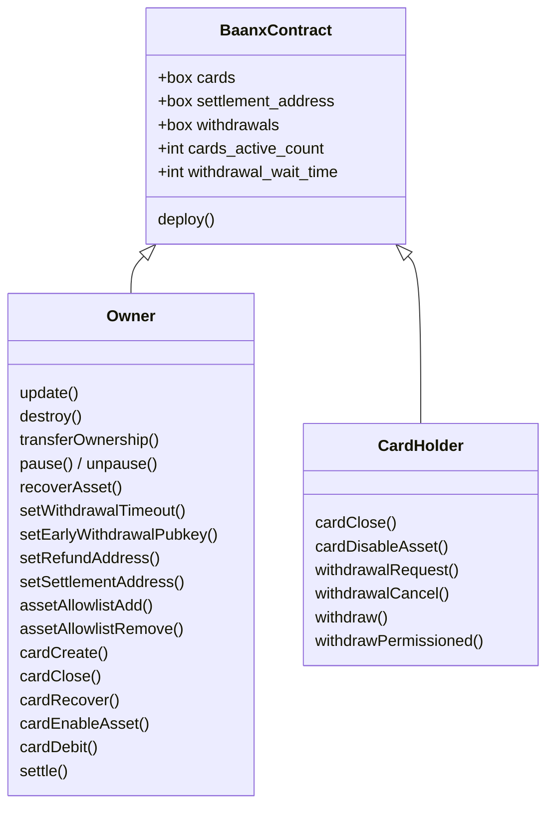
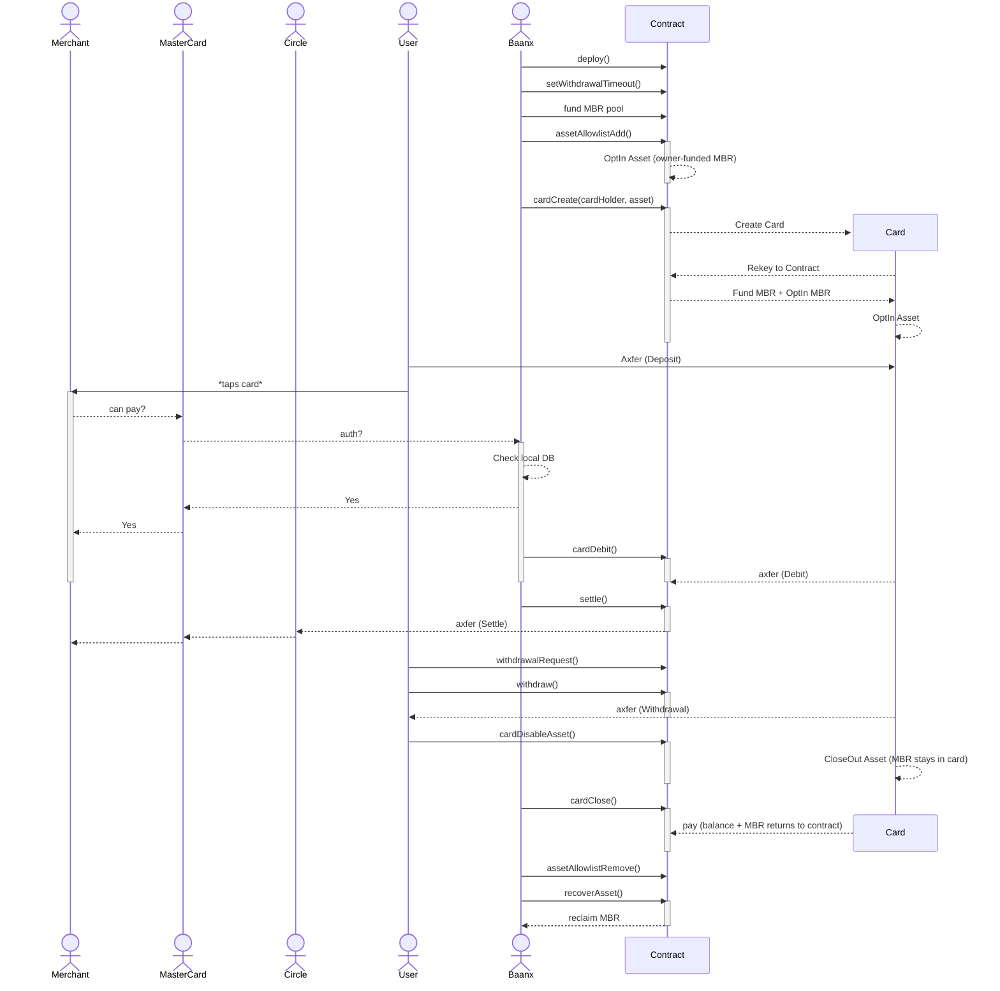

# Concept

This concept uses a single contract that "generates" a new address for each card that's created. Every card is a rekeyed account controlled by the contract.

All minimum balance requirements (MBR) — box storage, account minimum balances and asset opt-in MBR — are **pre-funded by the contract owner**. Callers never attach MBR payments. When a card, asset opt-in or allowlist entry is removed, the freed MBR returns to the contract and the owner can reclaim it with `recoverAsset`.

## Usage

To install dependencies:

```bash
pnpm install
```

To run a full test (requires `algokit localnet start`):

```bash
pnpm test
```

To compile the contracts and regenerate the typed clients:

```bash
pnpm build
```

## Roles

- **Owner** — administers the contract: creates/closes cards, manages the asset allowlist, debits cards, refunds, settles, and reclaims MBR. Inherited from `Ownable` and transferable via `transferOwnership`.
- **Pauser** — can `pause`/`unpause` the contract, halting debits and refunds. Inherited from `Pausable`.
- **Card holder** — the account assigned as a card's `owner`. Can opt the card in/out of assets and initiate/cancel/execute withdrawals.

## Methods

### Administration

#### deploy(address)address

Deploy the contract, setting the provided address as the owner.

#### update()void

Allows the owner to update the contract.

#### destroy()void

Destroy the contract, returning all Algo to the owner. Only possible when there are no active cards.

#### transferOwnership(address)void / owner()address

Transfer or read contract ownership.

#### pause()void / unpause()void / pauser()address / updatePauser(address)void

Pause/unpause the contract and manage the pauser role.

#### recoverAsset(uint64,uint64,address)void

Allows the owner to recover Algo (asset `0`) or any ASA held by the contract — used to reclaim MBR that has returned to the contract.

### Configuration

#### setWithdrawalTimeout(uint64)void

Set the number of seconds a permissionless withdrawal request must wait before it can be executed.

#### setEarlyWithdrawalPubkey(byte[32])void

Set the ed25519 public key used to authorize permissioned (early) withdrawals.

#### setRefundAddress(address)void / getRefundAddress()address

Set/read the address allowed to issue refunds.

#### setSettlementAddress(uint64,address)void / getSettlementAddress(uint64)address

Set/read the settlement address that funds for a given asset are settled to.

### Asset allowlist

#### assetAllowlistAdd(uint64,address)void

Owner-only. Opts the contract into an asset (MBR funded by the contract) and records its settlement address.

#### assetAllowlistRemove(uint64)void

Owner-only. Closes the contract out of an asset and deletes its settlement address. The freed MBR remains in the contract.

### Cards

#### cardCreate(address,uint64)address

Owner-only. Generates a brand new rekeyed account for the given card holder and funds its minimum balance (plus asset opt-in MBR if an asset is provided) from the contract. Returns the new card address.

#### cardClose(address)void

Owner or card holder. Closes the card account back to the contract and deletes its box, returning all balances and MBR to the contract.

#### cardRecover(address,address)void

Owner-only. Reassigns a card to a new card holder.

#### cardEnableAsset(address,uint64)void

Owner-only. Opts a card into an asset, funding the opt-in MBR from the contract.

#### cardDisableAsset(address,uint64)void

Owner or card holder. Closes the card out of an asset; the freed MBR stays within the card account.

#### getCardData(address)(address,address,uint64,uint64)

Returns a card's `(owner, address, nonce, withdrawalNonce)`.

#### getNextCardNonce(address)uint64

Read a card's debit nonce. (The withdrawal nonce is available via `getCardData`.)

### Debits, refunds & settlement

#### cardDebit(address,uint64,uint64,uint64,string)void

Owner-only, when not paused. Debits an amount of an asset from a card to the contract. Args: `card, asset, amount, nonce, reference`.

#### cardRefund(address,uint64,uint64,uint64)void

Refund-address only, when not paused. Refunds an amount of an asset from the contract back to a card. Args: `card, asset, amount, nonce`.

#### settle(uint64,uint64,uint64)void

Settle a debited balance for an asset to its settlement address. Args: `asset, amount, nonce`.

#### getNextSettlementNonce()uint64

Read the next settlement nonce.

### Withdrawals

#### withdrawalRequest(address,uint64,uint64)(...)

Card holder. Creates a permissionless withdrawal request for `card, asset, amount`. Returns the stored request.

#### withdrawalCancel(address)void

Card holder. Cancels a pending withdrawal request.

#### withdraw(address,uint64)void

Card holder. Executes a pending permissionless withdrawal once the wait time has elapsed.

#### withdrawPermissioned(address,uint64,uint64,uint64,uint64,byte[64])void

Card holder. Executes an early withdrawal before the wait time elapses, authorized by an ed25519 signature from the early-withdrawal public key. Args: `card, asset, amount, expiresAt, nonce, signature`.

## Contract diagram



## Lifecycle


